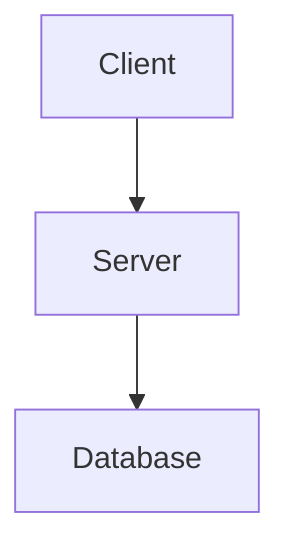

# Confluence Data Center Skill for Claude Code

[](https://opensource.org/licenses/MIT)

A comprehensive Claude Code skill that provides expert guidance for managing Confluence Data Center documentation, including Wiki Markup mastery, Markdown conversion, Mermaid diagram integration, and interaction with the Atlassian Data Center MCP server.

---

## Table of Contents

- [What is a Skill?](#what-is-a-skill)
- [How This Skill Works](#how-this-skill-works)
- [Installation Levels](#installation-levels)
- [Multi-Instance Confluence Support](#multi-instance-confluence-support)
- [Prerequisites](#prerequisites)
- [Quick Start](#quick-start)
- [Uploading Markdown to Confluence](#uploading-markdown-to-confluence)
- [Features](#features)
- [File Structure](#file-structure)
- [Key Documentation](#key-documentation)
- [Common Workflows](#common-workflows)
- [Best Practices](#best-practices)
- [Troubleshooting](#troubleshooting)
- [Integration with Other Skills](#integration-with-other-skills)
- [Advanced Usage](#advanced-usage)
- [Support](#support)
- [Contributing](#contributing)
- [License](#license)
- [Related Resources](#related-resources)

---

## What is a Skill?

A **skill** is an instruction manual that teaches Claude Code how to use MCP (Model Context Protocol) tools effectively. Think of it this way:

- **MCP Server** (`compasify-confluence-dc`) = The tool that provides access to Confluence APIs
- **Skill** (this repository) = The instruction manual that guides Claude on best practices, conversion patterns, and workflows for using that tool

Claude Code can discover and use MCP tools automatically, but skills provide the critical context, workflows, and domain expertise that make interactions efficient, reliable, and consistent with documentation best practices.

## How This Skill Works

This skill works with the **Compasify Confluence Data Center MCP server** (`compasify-confluence-dc`). The MCP provides raw access to Confluence's API capabilities, while this skill provides:

- **Format conversion expertise** for Markdown to Wiki Markup transformations
- **Diagram rendering workflows** for Mermaid to PNG/SVG conversion
- **CQL query construction** guidance and examples
- **Best practices** for page creation, updates, and content organization
- **Troubleshooting guides** for common errors and edge cases

When you ask Claude Code to work with Confluence, this skill ensures operations follow proven patterns, handle format conversions correctly, and maintain documentation quality.

---

## Installation Levels

This skill can be installed at multiple levels depending on your organizational structure and needs:

### 1. Global Installation (User Level)

Install in your home directory for use across all projects:

```bash
~/.claude/skills/confluence-dc/
```

**Use case**: You work with a single Confluence instance across all projects.

### 2. Project-Level Installation

Install within a specific project directory:

```bash
/path/to/project/.claude/skills/confluence-dc/
```

**Use case**: Project-specific Confluence configuration, custom templates, or documentation workflows that differ from other projects.

### 3. Workspace-Level Installation

Install at a workspace directory that groups multiple related projects:

```bash
~/workspace/acme-corp/.claude/skills/confluence-dc/
~/workspace/tech-startup/.claude/skills/confluence-dc/
```

**Use case**:
- **Client-based workspaces**: Different documentation standards for different clients
- **Department-based workspaces**: Engineering vs Product vs Support documentation patterns
- **Company-based workspaces**: Multiple clients with different Confluence instances

### Installation Priority

Claude Code follows this priority order when loading skills:
1. **Project-level** (`.claude/skills/` in current directory)
2. **Workspace-level** (`.claude/skills/` in parent directories)
3. **Global-level** (`~/.claude/skills/` in home directory)

This allows project-specific customizations to override workspace or global defaults.

---

## Multi-Instance Confluence Support

For organizations that need to connect to multiple Confluence Data Center instances, you can configure the MCP at different levels using `.mcp.json` files.

### Example: Multiple Client Workspaces

```bash
# Client 1 workspace
~/clients/acme-industries/
├── .mcp.json                     # Confluence config for confluence.acme.com
├── .claude/
│   └── settings.local.json
├── project-alpha/
└── project-beta/

# Client 2 workspace
~/clients/globex-corp/
├── .mcp.json                     # Confluence config for wiki.globex.com
├── .claude/
│   └── settings.local.json
├── web-app/
└── mobile-app/
```

### .mcp.json Configuration (Data Center)

Each workspace can have its own `.mcp.json` file with Confluence credentials:

```json
{
  "mcpServers": {
    "compasify-confluence-dc": {
      "command": "npx",
      "args": ["-y", "@compasify/confluence-dc"],
      "env": {
        "CONFLUENCE_HOST": "https://confluence.yourcompany.com",
        "CONFLUENCE_API_TOKEN": "your-personal-access-token-here"
      }
    }
  }
}
```

---

## Prerequisites

### Required MCP Server

The **Atlassian Confluence Data Center MCP server** must be configured in Claude Code:

```bash
npm install -g @compasify/confluence-dc
```

Configure in `~/.claude/mcp.json` or workspace-level `.mcp.json`:

```json
{
  "mcpServers": {
    "compasify-confluence-dc": {
      "command": "npx",
      "args": ["-y", "@compasify/confluence-dc"],
      "env": {
        "CONFLUENCE_HOST": "https://confluence.yourcompany.com",
        "CONFLUENCE_API_TOKEN": "your-personal-access-token"
      }
    }
  }
}
```

### Personal Access Token (PAT)

Generate a Personal Access Token in Confluence Data Center:
1. Click your profile picture in the top right.
2. Select **Settings**.
3. Choose **Personal Access Tokens** from the sidebar.
4. Click **Create token**.
5. Give the token a name, set an expiry (optional), and click **Create**.
6. Copy the token and add to your `.mcp.json` configuration as `CONFLUENCE_API_TOKEN`.

### Permissions

Ensure your account has appropriate permissions for:
- Creating/updating pages
- Searching content
- Managing spaces
- Adding labels and comments
- Uploading attachments

### Optional Tools

For full functionality, install these optional tools:

```bash
# Mermaid CLI for diagram rendering
npm install -g @mermaid-js/mermaid-cli

# Additional conversion tools (optional)
npm install -g markdown2confluence
```

---

## Quick Start

### 1. Install the Skill Manually

```bash
# Global installation
mkdir -p ~/.claude/skills/
cd ~/.claude/skills/
git clone https://github.com/SpillwaveSolutions/confluence-skill confluence

# OR workspace installation
mkdir -p ~/workspace/acme-corp/.claude/skills/
cd ~/workspace/acme-corp/.claude/skills/
git clone https://github.com/SpillwaveSolutions/confluence-skill confluence

# OR project installation
mkdir -p /path/to/project/.claude/skills/
cd /path/to/project/.claude/skills/
git clone https://github.com/SpillwaveSolutions/confluence-skill confluence
```

### 2. Configure Atlassian Data Center MCP

Create or update `.mcp.json` at the appropriate level:

```json
{
  "mcpServers": {
    "compasify-confluence-dc": {
      "command": "npx",
      "args": ["-y", "@compasify/confluence-dc"],
      "env": {
        "CONFLUENCE_HOST": "https://confluence.yourcompany.com",
        "CONFLUENCE_API_TOKEN": "your-pat-here"
      }
    }
  }
}
```

### 3. Start Using Confluence with Claude Code

Simply ask Claude Code to work with Confluence:

```
"Create a Confluence page from this Markdown document in the DEV space"
"Search Confluence for pages about API authentication"
"Convert this Wiki Markup to Markdown"
"Update the 'Getting Started' page with this new content"
"Render these Mermaid diagrams and upload to Confluence"
```

Claude Code will automatically:
- Validate space keys
- Convert between Markdown and Wiki Markup
- Render Mermaid diagrams to images
- Construct proper CQL queries
- Handle page hierarchies
- Follow best practices from this skill

---

## Uploading Markdown to Confluence

The skill includes an upload script (`scripts/upload_confluence.py`) that converts Markdown files to Confluence pages using the Data Center API.

### Quick Upload Examples

**Smart upload (reads metadata from frontmatter):**
```bash
python3 ~/.claude/skills/confluence-dc/scripts/upload_confluence.py page.md
```

**Update specific page by ID:**
```bash
python3 ~/.claude/skills/confluence-dc/scripts/upload_confluence.py page.md --id 450855912
```

**Create new page in a space:**
```bash
python3 ~/.claude/skills/confluence-dc/scripts/upload_confluence.py page.md --space ARCP --parent-id 123456
```

### Download, Edit, Upload Workflow

The most powerful feature is the workflow for updating existing pages:

```bash
# 1. Download a page (gets frontmatter with all metadata)
python3 ~/.claude/skills/confluence-dc/scripts/download_confluence.py 450855912

# 2. Edit the markdown file locally
vim Data_Source_Registry_Manager_API.md

# 3. Upload changes (reads everything from frontmatter)
python3 ~/.claude/skills/confluence-dc/scripts/upload_confluence.py Data_Source_Registry_Manager_API.md
```

### Mermaid Diagram Support

Mermaid diagrams in your Markdown are automatically rendered to SVG images and uploaded as attachments:

````markdown
## Architecture Diagram


````

### Credential Discovery

The scripts automatically discover credentials from:

1. Environment variables (`CONFLUENCE_HOST`, `CONFLUENCE_API_TOKEN`)
2. Claude MCP config files (`~/.claude/mcp.json` or `.mcp.json` in project/workspace)
3. Local `.env` file in current or parent directories

Example `.env` file:
```bash
CONFLUENCE_HOST=https://confluence.yourcompany.com
CONFLUENCE_API_TOKEN=your_personal_access_token_here
```

---

## Features

### Page Management
- Create pages with proper hierarchy
- Update existing pages
- Search with CQL (Confluence Query Language)
- Get page details and content
- Delete pages
- Manage page children and relationships

### Format Conversion
- Markdown to Confluence Wiki Markup
- Wiki Markup to Markdown
- Preserve formatting and structure
- Handle nested elements (lists, tables, code blocks)
- Convert inline formatting (bold, italic, code)

### Diagram Integration
- Render Mermaid diagrams to PNG/SVG
- Extract diagrams from Markdown files
- Upload diagrams as attachments
- Embed diagrams in Confluence pages
- Support all Mermaid diagram types

### Content Organization
- Add labels to pages
- Create page hierarchies with parent/child relationships
- Manage comments
- Search with advanced CQL queries
- Organize content with proper structure

### Batch Operations
- Create multiple pages from directory structure
- Sync entire documentation repositories
- Mass updates with version control

---

## File Structure

```
~/.claude/skills/confluence-dc/
├── CLAUDE.md                         # Architecture guide for Claude Code
├── README.md                         # This file
├── SKILL.md                          # Detailed skill documentation
├── QUICK_REFERENCE.md                # Command cheat sheet
├── INSTALLATION.md                   # Installation guide
├── PARENT_RELATIONSHIP_GUIDE.md      # Parent relationship handling guide
├── scripts/
│   ├── confluence_api.py             # Shared DC API client
│   ├── upload_confluence.py          # Upload Markdown to Confluence
│   ├── download_confluence.py        # Download Confluence pages to Markdown
│   ├── convert_markdown_to_wiki.py   # Markdown to Wiki Markup converter
│   └── render_mermaid.py             # Mermaid diagram renderer
├── references/
│   ├── mcp-config-paths.md           # DC MCP configuration guide
│   ├── api-fallback.md               # API fallback documentation
│   ├── confluence-macros.md          # DC Macro reference
│   ├── wiki_markup_guide.md          # Complete Wiki Markup reference
│   └── conversion_guide.md           # Conversion rules and edge cases
├── examples/
│   └── sample-confluence-page.md     # Example Markdown document
└── assets/
    └── (diagram examples)
```

---

## Key Documentation

### SKILL.md (Primary Reference)
Comprehensive workflow documentation including:
- Page creation and update workflows
- Format conversion patterns
- Mermaid diagram integration
- CQL query patterns
- Troubleshooting guide
- Best practices

### QUICK_REFERENCE.md
Quick command reference for common tasks and format conversion cheat sheet.

### references/wiki_markup_guide.md
Complete Wiki Markup syntax reference for Data Center, including headings, lists, tables, and macros.

### references/mcp-config-paths.md
Guide on how to configure the `compasify-confluence-dc` MCP server across different projects and environments.

### references/api-fallback.md
Documentation on using the Python scripts as a fallback when the MCP server hits limitations (e.g., large attachments or complex macros).

---

## Common Workflows

### Creating Pages from Markdown

```
"Create a Confluence page from this Markdown in the DEV space titled 'API Guide'"
"Convert this Markdown document with Mermaid diagrams to Confluence"
"Create a page under 'Documentation' parent with this content"
```

### Searching Confluence

```
"Search Confluence for pages about authentication in the DEV space"
"Find all pages labeled 'api' created this month"
"Show me pages in DEV space modified in the last 7 days"
```

### Format Conversion

```
"Convert this Wiki Markup to Markdown"
"Convert this Markdown to Confluence format"
"Show me how to write a table in Wiki Markup"
```

### Diagram Rendering

```
"Render this Mermaid diagram and create a Confluence page"
"Extract all diagrams from this Markdown and upload to Confluence"
```

### Updating Pages

```
"Update the 'Getting Started' page in DEV space with this new content"
"Find and update the authentication guide with these changes"
```

---

## Best Practices

### 1. Validate Space Keys
Always verify space keys before operations:
```
"What Confluence spaces are available?"
```

### 2. Use Proper Page Hierarchies
Organize content with parent-child relationships for better navigation.

### 3. Apply Consistent Labels
Use labels for organization and discovery:
```
"Create this page with labels: api, documentation, authentication"
```

### 4. Test Conversions on Samples
Verify format conversions before bulk operations for complex documents.

### 5. Keep Diagram Sources in Git
Always commit `.mmd` files alongside your Markdown to maintain the source of truth.

### 6. Add Version Comments
Track changes with meaningful version comments to help others understand the evolution of the document.

---

## Troubleshooting

### "Space not found"
- Use `"What Confluence spaces are available?"` to see available spaces.
- Verify space key is exact (case-sensitive).

### "Permission denied" or "Auth failure"
- Verify your Personal Access Token (PAT) is valid.
- Ensure the token has sufficient permissions in the target space.
- Check if your Confluence host requires a VPN or specific network access.

### SSL Certificate Issues
If your internal Confluence uses a self-signed certificate, you may need to set `NODE_TLS_REJECT_UNAUTHORIZED=0` in your MCP environment (not recommended for production) or add the CA to your trusted store.

### API Host URL
Ensure `CONFLUENCE_HOST` is the base URL of your instance (e.g., `https://confluence.company.com`) without the `/wiki` suffix often required by Cloud instances.

### Format conversion issues
- Review `conversion_guide.md` for edge cases.
- Test problematic sections separately.
- Check for unsupported Markdown extensions.

---

## Integration with Other Skills

This Confluence skill can work alongside other Claude Code skills:

### JIRA Skill
Link documentation to JIRA issues by referencing issue keys.

### Project Documentation Skills
Maintain project-specific documentation by syncing local READMEs and architecture files.

### Meeting Notes Skills
Convert meeting notes captured during sessions into structured Confluence documentation.

---

## Advanced Usage

### Custom CQL Queries
See `SKILL.md` for complex search patterns, date/time functions, and historical search capabilities.

### Batch Synchronization
Use the provided Python scripts in `scripts/` to automate bulk page creation or directory synchronization.

### Custom Macros
Data Center supports a wide range of macros. See `references/confluence-macros.md` for instructions on how to prompt Claude to include them in generated content.

---

## Support

For issues or questions:

1. **Check SKILL.md** for detailed workflows.
2. **Review QUICK_REFERENCE.md** for common commands.
3. **Review references/** for Wiki Markup and conversion help.
4. **Consult Atlassian Data Center MCP documentation**.
5. **Verify .mcp.json configuration**.

---

## Contributing

To improve this skill:

1. Document new workflows in `SKILL.md`.
2. Add conversion patterns to `references/conversion_guide.md`.
3. Create example files in `examples/`.
4. Share automation scripts in `scripts/`.
5. Update best practices based on experience.

---

## License

This skill is designed for use with Claude Code and the Atlassian Data Center MCP server.

---

## Related Resources

- [Claude Code Documentation](https://docs.claude.com/claude-code)
- [Model Context Protocol](https://modelcontextprotocol.io/)
- [Atlassian Confluence DC Documentation](https://confluence.atlassian.com/alldoc/atlassian-data-center-documentation-1014265432.html)
- [Confluence Wiki Markup Reference](https://confluence.atlassian.com/doc/confluence-wiki-markup-251003035.html)
- [Compasify Confluence DC MCP Server](https://github.com/compasify/confluence-dc)
- [Mermaid Diagram Syntax](https://mermaid.js.org/)
